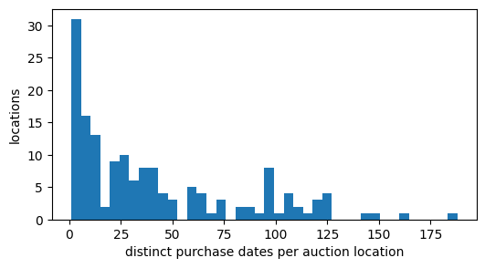

# kick

> Generated from [`dataset.py`](dataset.py) by `dataset check` (or `build`). Do not edit this page: change `dataset.py` and re-run the check.

Binary classification of `IsBadBuy`, scored with `roc_auc` on temporal splits by `PurchDate`. 72,983 rows and 32 features. Source: Kaggle (2011).

Built as `01a11191-2bb7-7949-83a9-f40803cf6445` on 2026-10-06. See [Build](#build).

## Files in this folder

| file | what it is |
|---|---|
| [`dataset.py`](dataset.py) | The definition, and the only file edited by hand: metadata, reading and cleaning the raw files, feature types and splits. |
| [`explore.ipynb`](explore.ipynb) | The workbench for looking at the data (`ds = workbench()`), committed without outputs. Not needed to rebuild. |
| [`README.md`](README.md) | This page, generated by `dataset check` and `dataset build`. |
| [`figures/`](figures) | The figures of the decisions below, generated with this page. |

- The curation record, with the triage decision and its sources: [`curation/records/kick.md`](../../../../curation/records/kick.md)
- The original source: <https://www.kaggle.com/competitions/DontGetKicked/overview>
- The collection this folder belongs to: [`tabarena-v0pt2/README.md`](../README.md) and [`tabarena-v0pt2/CHANGELOG.md`](../CHANGELOG.md)

## Rebuild

`dataset.py` reads its raw files from `local-data-warehouse/kick/`. To get them:

```text
kaggle competitions download -c dontgetkicked -p local-data-warehouse/kick
unzip local-data-warehouse/kick/dontgetkicked.zip -d local-data-warehouse/kick/
rm local-data-warehouse/kick/dontgetkicked.zip
```

Then, from the repository root:

```bash
.venv/bin/python -m data_foundry.curation.cli dataset check datasets/_dev/tabarena-v0pt2/kick   # pipeline and checks, no UUID; rewrites this page
.venv/bin/python -m data_foundry.curation.cli dataset build datasets/_dev/tabarena-v0pt2/kick   # also saves the container and records its UUID
```

Only curators run `build`, when the dataset ships.

## Dataset and task

| field | value |
|---|---|
| source | Kaggle: https://www.kaggle.com/competitions/DontGetKicked/overview |
| year | 2011 |
| domain | business & marketing |
| license | Public Domain |
| data_tags | Non-IID, Temporal |
| reference | DontGetKicked |
| rows x columns | 72,983 x 33 |
| task.target | IsBadBuy |
| task.problem_type | binary_classification |
| task.metric | roc_auc |
| task.split_regime | temporal_non_iid |
| task.stratify_on | IsBadBuy |
| task.time_on | PurchDate |

<details>
<summary>Feature types: 18 categorical, 0 string, 1 datetime</summary>

- categorical (18): `WheelTypeID`, `BYRNO`, `VNZIP1`, `PRIMEUNIT`, `AUCGUART`, `WheelType`, `Trim`, `SubModel`, `Color`, `Transmission`, `Nationality`, `Size`, `TopThreeAmericanName`, `Auction`, `Make`, `Model`, `VNST`, `IsBadBuy`
- string (0): none
- datetime (1): `PurchDate`

</details>

<details>
<summary>BibTeX</summary>

```bibtex
@misc{DontGetKicked,
    author = {faysal and Will Adams and Will Cukierski},
    title = {Don't Get Kicked!},
    year = {2011},
    howpublished = {\url{https://kaggle.com/competitions/DontGetKicked}},
    note = {Kaggle}
}
```

</details>

## Sample rows

The first 5 of 72,983 rows of the final frame (the oldest rows: the frame is sorted by `PurchDate`); 12 of 33 columns, the target first. Cells are cut at 40 characters.

| IsBadBuy | PurchDate | Auction | VehYear | VehicleAge | Make | Model | Trim | SubModel | Color | Transmission | WheelTypeID |
|---|---|---|---|---|---|---|---|---|---|---|---|
| 0 | 2009-01-05 00:00:00 | MANHEIM | 2004 | 5 | CHEVROLET | TRAILBLAZER 4WD 6C 4 | Nor | 4D SUV 4.2L LS | SILVER | AUTO | 1 |
| 0 | 2009-01-05 00:00:00 | MANHEIM | 2005 | 4 | PONTIAC | GRAND PRIX 3.8L V6 S | Bas | 4D SEDAN | GOLD | AUTO | 1 |
| 0 | 2009-01-05 00:00:00 | MANHEIM | 2007 | 2 | FORD | FIVE HUNDRED 3.0L V6 | SEL | 4D SEDAN SEL | SILVER | AUTO | 1 |
| 0 | 2009-01-05 00:00:00 | MANHEIM | 2007 | 2 | CHEVROLET | IMPALA V6 3.5L V6 SF | LT | 4D SEDAN LT 3.5L | GREY | AUTO | 1 |
| 0 | 2009-01-05 00:00:00 | MANHEIM | 2004 | 5 | FORD | TAURUS 3.0L V6 EFI | SES | 4D SEDAN SES DURATEC | GOLD | AUTO | 1 |

## Curation notes

- The data is from a Kaggle competition. Its train/test split is neither temporal nor grouped: both cover January 2009 to December 2010 (test is 36-44% of every quarter), and 78.9% of test rows are at an auction location ("Auction" + "VNZIP1") that also occurs in train (72 of 128 test locations); some locations are only in test.
- The data is temporal and also grouped by auction location. Locations reappear over time, so a grouped split would test unseen auctions, which does not match deployment; a model is deployed on future purchases at mostly known auctions. Therefore, we use temporal evaluation.
- The test features from the Kaggle competition are available and could be used for unsupervised approaches.
- We transform "PurchDate" to datetime.
- We drop the "RefId" column, as it is just an identifier and not useful for modeling.
- We assign the categorical features "WheelTypeID", "BYRNO", and "VNZIP1" to category dtype, as they are given as numbers.
- Potential leak, kept on purpose: missing "WheelType" may be filled in (blanked) when a car is kicked back. It is missing for about 25% of bad buys in every month but for only 1.5% of good cars, erratically (Sep-Oct 2010: 1 good vs 218 bad cars). Dropping WheelType and WheelTypeID lowers LightGBM ROC AUC on our temporal splits from 0.757 to 0.691. We keep both because this is how the company released the data for the competition (WheelType is missing in 4.5% of the Kaggle test rows vs 4.3% of train) and the field's recording process is not documented.

## Splits

Expanding-window temporal splits: 9 test window(s) of 28 time values, walking back from the newest data, newest first; train is all earlier data.

9 repeat(s) x 1 fold(s) with seed 4267; train 35,514 to 69,278 rows, test 3,605 to 5,164 rows. Prediction horizon: 28 days.

| repeat | fold | n_train | n_test | train_start | train_end | test_start | test_end |
|---|---|---|---|---|---|---|---|
| 0 | 0 | 69278 | 3705 | 2009-01-05 00:00:00 | 2010-11-22 00:00:00 | 2010-11-23 00:00:00 | 2010-12-30 00:00:00 |
| 1 | 0 | 64114 | 5164 | 2009-01-05 00:00:00 | 2010-10-13 00:00:00 | 2010-10-14 00:00:00 | 2010-11-22 00:00:00 |
| 2 | 0 | 59754 | 4360 | 2009-01-05 00:00:00 | 2010-09-03 00:00:00 | 2010-09-06 00:00:00 | 2010-10-13 00:00:00 |
| 3 | 0 | 56149 | 3605 | 2009-01-05 00:00:00 | 2010-07-27 00:00:00 | 2010-07-28 00:00:00 | 2010-09-03 00:00:00 |
| 4 | 0 | 52221 | 3928 | 2009-01-05 00:00:00 | 2010-06-17 00:00:00 | 2010-06-18 00:00:00 | 2010-07-27 00:00:00 |
| 5 | 0 | 47942 | 4279 | 2009-01-05 00:00:00 | 2010-05-07 00:00:00 | 2010-05-10 00:00:00 | 2010-06-17 00:00:00 |
| 6 | 0 | 43980 | 3962 | 2009-01-05 00:00:00 | 2010-03-30 00:00:00 | 2010-03-31 00:00:00 | 2010-05-07 00:00:00 |
| 7 | 0 | 40008 | 3972 | 2009-01-05 00:00:00 | 2010-02-19 00:00:00 | 2010-02-20 00:00:00 | 2010-03-30 00:00:00 |
| 8 | 0 | 35514 | 4494 | 2009-01-05 00:00:00 | 2010-01-12 00:00:00 | 2010-01-13 00:00:00 | 2010-02-19 00:00:00 |

## Decisions

### 1. Temporal split, not grouped by auction location

Auction locations (auction and ZIP code) reappear over time, so a grouped split would not match deployment; a model is deployed on future purchases.

| index | value |
|---|---|
| auction locations | 155 |
| seen on more than one date | 140 |
| rows at a location seen on more than one date | 99.9% |

### 2. Auction locations recur across the whole period

Most locations are seen on many purchase dates, so there is no clean set of unseen locations.



## Bundle checks

0 error(s), 0 warning(s), 0 info (26 checks run, plus the dataset's own checks).


## Data checks

### Feature summary

<details>
<summary>Show the table (33 rows)</summary>

| index | dtype | n_missing | pct_missing | n_unique | examples |
|---|---|---|---|---|---|
| PRIMEUNIT | category | 69564 | 95.32 | 2 | NO, YES |
| AUCGUART | category | 69564 | 95.32 | 2 | GREEN, RED |
| WheelType | category | 3174 | 4.35 | 3 | Alloy, Covers, Special |
| WheelTypeID | category | 3169 | 4.34 | 4 | 1.0, 2.0, 3.0, 0.0 |
| Trim | category | 2360 | 3.23 | 134 | Bas, LS, SE, SXT, LT, LX, Tou, EX, SEL, XLT |
| SubModel | category | 8 | 0.01 | 863 | 4D SEDAN, 4D SEDAN LS, 4D SEDAN SE, 4D WAGON, MINIVAN 3.3L, 4D SUV 4.2L LS, 4D … |
| Color | category | 8 | 0.01 | 16 | SILVER, WHITE, BLUE, GREY, BLACK, RED, GOLD, GREEN, MAROON, BEIGE |
| Transmission | category | 9 | 0.01 | 3 | AUTO, MANUAL, Manual |
| Nationality | category | 5 | 0.01 | 4 | AMERICAN, OTHER ASIAN, TOP LINE ASIAN, OTHER |
| Size | category | 5 | 0.01 | 12 | MEDIUM, LARGE, MEDIUM SUV, COMPACT, VAN, LARGE TRUCK, SMALL SUV, SPECIALTY, CRO… |
| TopThreeAmericanName | category | 5 | 0.01 | 4 | GM, CHRYSLER, FORD, OTHER |
| IsBadBuy | category | 0 | 0 | 2 | 0, 1 |
| Auction | category | 0 | 0 | 3 | MANHEIM, OTHER, ADESA |
| Make | category | 0 | 0 | 33 | CHEVROLET, DODGE, FORD, CHRYSLER, PONTIAC, KIA, SATURN, NISSAN, HYUNDAI, JEEP |
| Model | category | 0 | 0 | 1063 | PT CRUISER, IMPALA, TAURUS, CALIBER, CARAVAN GRAND FWD V6, MALIBU 4C, TAURUS 3.… |
| BYRNO | category | 0 | 0 | 74 | 99761, 18880, 835, 3453, 22916, 21053, 19619, 99750, 17675, 20928 |
| VNZIP1 | category | 0 | 0 | 153 | 32824, 27542, 75236, 74135, 80022, 85226, 85040, 29697, 95673, 28273 |
| VNST | category | 0 | 0 | 37 | TX, FL, CA, NC, AZ, CO, SC, OK, GA, TN |
| PurchDate | datetime64\[ns\] | 0 | 0 | 517 | 2010-11-23 00:00:00, 2009-02-25 00:00:00, 2010-12-08 00:00:00, 2010-10-13 00:00… |
| MMRCurrentAuctionAveragePrice | float64 | 315 | 0.43 | 10315 | 0.0, 5480.0, 5569.0, 6311.0, 8186.0, 7269.0, 6858.0, 7644.0, 8196.0, 8033.0 |
| MMRCurrentAuctionCleanPrice | float64 | 315 | 0.43 | 11265 | 0.0, 6461.0, 6584.0, 7450.0, 8107.0, 1.0, 8892.0, 9279.0, 7898.0, 9044.0 |
| MMRCurrentRetailAveragePrice | float64 | 315 | 0.43 | 12493 | 0.0, 6418.0, 6515.0, 7316.0, 7907.0, 11674.0, 8756.0, 9352.0, 10834.0, 5439.0 |
| MMRCurrentRetailCleanPrice | float64 | 315 | 0.43 | 13192 | 0.0, 7478.0, 7611.0, 8546.0, 9256.0, 10103.0, 10268.0, 12864.0, 11413.0, 12387.0 |
| MMRAcquisitionAuctionAveragePrice | float64 | 18 | 0.02 | 10342 | 0.0, 5480.0, 5569.0, 6311.0, 6858.0, 7644.0, 4573.0, 8196.0, 6892.0, 7048.0 |
| MMRAcquisitionAuctionCleanPrice | float64 | 18 | 0.02 | 11379 | 0.0, 6461.0, 6584.0, 7450.0, 8107.0, 1.0, 8892.0, 9044.0, 5967.0, 7614.0 |
| MMRAcquisitionRetailAveragePrice | float64 | 18 | 0.02 | 12725 | 0.0, 6418.0, 6515.0, 7316.0, 7907.0, 8756.0, 9352.0, 5439.0, 11114.0, 7943.0 |
| MMRAcquisitonRetailCleanPrice | float64 | 18 | 0.02 | 13456 | 0.0, 7478.0, 7611.0, 8546.0, 9256.0, 10103.0, 10268.0, 6944.0, 11562.0, 9613.0 |
| VehBCost | float64 | 0 | 0 | 2072 | 7500.0, 6500.0, 7200.0, 6000.0, 4200.0, 7000.0, 8000.0, 7800.0, 7100.0, 7400.0 |
| VehYear | int64 | 0 | 0 | 10 | 2006, 2005, 2007, 2004, 2008, 2003, 2002, 2001, 2009, 2010 |
| VehicleAge | int64 | 0 | 0 | 10 | 4, 3, 5, 2, 6, 7, 1, 8, 9, 0 |
| VehOdo | int64 | 0 | 0 | 39947 | 77995, 75009, 79015, 71225, 75371, 67464, 77449, 88958, 73159, 75064 |
| IsOnlineSale | int64 | 0 | 0 | 2 | 0, 1 |
| WarrantyCost | int64 | 0 | 0 | 281 | 920, 1974, 2152, 1389, 1215, 1155, 803, 728, 1503, 1086 |

</details>

### Target distribution

| IsBadBuy | count | pct |
|---|---|---|
| 0 | 64007 | 87.7 |
| 1 | 8976 | 12.3 |

### Numeric features

<details>
<summary>Show the table (14 rows)</summary>

| index | count | mean | std | min | max |
|---|---|---|---|---|---|
| VehYear | 72983 | 2005.34 | 1.73125 | 2001 | 2010 |
| VehicleAge | 72983 | 4.17664 | 1.71221 | 0 | 9 |
| VehOdo | 72983 | 71500 | 14578.9 | 4825 | 115717 |
| MMRAcquisitionAuctionAveragePrice | 72965 | 6128.91 | 2461.99 | 0 | 35722 |
| MMRAcquisitionAuctionCleanPrice | 72965 | 7373.64 | 2722.49 | 0 | 36859 |
| MMRAcquisitionRetailAveragePrice | 72965 | 8497.03 | 3156.29 | 0 | 39080 |
| MMRAcquisitonRetailCleanPrice | 72965 | 9850.93 | 3385.79 | 0 | 41482 |
| MMRCurrentAuctionAveragePrice | 72668 | 6132.08 | 2434.57 | 0 | 35722 |
| MMRCurrentAuctionCleanPrice | 72668 | 7390.68 | 2686.25 | 0 | 36859 |
| MMRCurrentRetailAveragePrice | 72668 | 8775.72 | 3090.7 | 0 | 39080 |
| MMRCurrentRetailCleanPrice | 72668 | 10145.4 | 3310.25 | 0 | 41062 |
| VehBCost | 72983 | 6730.93 | 1767.85 | 1 | 45469 |
| IsOnlineSale | 72983 | 0.0252799 | 0.156975 | 0 | 1 |
| WarrantyCost | 72983 | 1276.58 | 598.847 | 462 | 7498 |

</details>

### Categorical features

<details>
<summary>Show the table (84 rows)</summary>

| column | rank | value | count | pct |
|---|---|---|---|---|
| AUCGUART | 1 | &lt;NA> | 69564 | 95.32 |
| AUCGUART | 2 | GREEN | 3340 | 4.58 |
| AUCGUART | 3 | RED | 79 | 0.11 |
| Auction | 1 | MANHEIM | 41043 | 56.24 |
| Auction | 2 | OTHER | 17501 | 23.98 |
| Auction | 3 | ADESA | 14439 | 19.78 |
| BYRNO | 1 | 99761 | 3943 | 5.4 |
| BYRNO | 2 | 18880 | 3588 | 4.92 |
| BYRNO | 3 | 835 | 2987 | 4.09 |
| BYRNO | 4 | 3453 | 2927 | 4.01 |
| BYRNO | 5 | 22916 | 2852 | 3.91 |
| Color | 1 | SILVER | 14875 | 20.38 |
| Color | 2 | WHITE | 12123 | 16.61 |
| Color | 3 | BLUE | 10347 | 14.18 |
| Color | 4 | GREY | 7887 | 10.81 |
| Color | 5 | BLACK | 7627 | 10.45 |
| IsBadBuy | 1 | 0 | 64007 | 87.7 |
| IsBadBuy | 2 | 1 | 8976 | 12.3 |
| Make | 1 | CHEVROLET | 17248 | 23.63 |
| Make | 2 | DODGE | 12912 | 17.69 |
| Make | 3 | FORD | 11305 | 15.49 |
| Make | 4 | CHRYSLER | 8844 | 12.12 |
| Make | 5 | PONTIAC | 4258 | 5.83 |
| Model | 1 | PT CRUISER | 2329 | 3.19 |
| Model | 2 | IMPALA | 1990 | 2.73 |
| Model | 3 | TAURUS | 1425 | 1.95 |
| Model | 4 | CALIBER | 1375 | 1.88 |
| Model | 5 | CARAVAN GRAND FWD V6 | 1289 | 1.77 |
| Nationality | 1 | AMERICAN | 61028 | 83.62 |
| Nationality | 2 | OTHER ASIAN | 8033 | 11.01 |
| Nationality | 3 | TOP LINE ASIAN | 3722 | 5.1 |
| Nationality | 4 | OTHER | 195 | 0.27 |
| Nationality | 5 | &lt;NA> | 5 | 0.01 |
| PRIMEUNIT | 1 | &lt;NA> | 69564 | 95.32 |
| PRIMEUNIT | 2 | NO | 3357 | 4.6 |
| PRIMEUNIT | 3 | YES | 62 | 0.08 |
| PurchDate | 1 | 2010-11-23 00:00:00 | 384 | 0.53 |
| PurchDate | 2 | 2009-02-25 00:00:00 | 379 | 0.52 |
| PurchDate | 3 | 2010-12-08 00:00:00 | 372 | 0.51 |
| PurchDate | 4 | 2010-10-13 00:00:00 | 359 | 0.49 |
| PurchDate | 5 | 2009-08-26 00:00:00 | 359 | 0.49 |
| Size | 1 | MEDIUM | 30785 | 42.18 |
| Size | 2 | LARGE | 8850 | 12.13 |
| Size | 3 | MEDIUM SUV | 8090 | 11.08 |
| Size | 4 | COMPACT | 7205 | 9.87 |
| Size | 5 | VAN | 5854 | 8.02 |
| SubModel | 1 | 4D SEDAN | 15236 | 20.88 |
| SubModel | 2 | 4D SEDAN LS | 4718 | 6.46 |
| SubModel | 3 | 4D SEDAN SE | 3859 | 5.29 |
| SubModel | 4 | 4D WAGON | 2230 | 3.06 |
| SubModel | 5 | MINIVAN 3.3L | 1258 | 1.72 |
| TopThreeAmericanName | 1 | GM | 25314 | 34.68 |
| TopThreeAmericanName | 2 | CHRYSLER | 23399 | 32.06 |
| TopThreeAmericanName | 3 | FORD | 12315 | 16.87 |
| TopThreeAmericanName | 4 | OTHER | 11950 | 16.37 |
| TopThreeAmericanName | 5 | &lt;NA> | 5 | 0.01 |
| Transmission | 1 | AUTO | 70398 | 96.46 |
| Transmission | 2 | MANUAL | 2575 | 3.53 |
| Transmission | 3 | &lt;NA> | 9 | 0.01 |
| Transmission | 4 | Manual | 1 | 0 |

(24 more rows not shown)

</details>

## Build

| field | value |
|---|---|
| uuid | 01a11191-2bb7-7949-83a9-f40803cf6445 |
| checksum | 3ee1b44c521ad59b2abcd1520f9b56ce5cdb7e37c7df653cd7bd92123087e941 |
| built_at | 2026-10-06T14:14:51+00:00 |
| path | kick/01a11191-2bb7-7949-83a9-f40803cf6445 |
| data_foundry_version | 0.0.5 |
| git_sha | 0a417ec7132b928f042a200e9e2b9e72a5171ef4-dirty |
| libraries | {'python': '3.11.14', 'pandas': '2.3.3', 'numpy': '2.1.3', 'pyarrow': '20.0.0', 'scikit-learn': '1.7.2', 'polars': '1.41.1'} |
